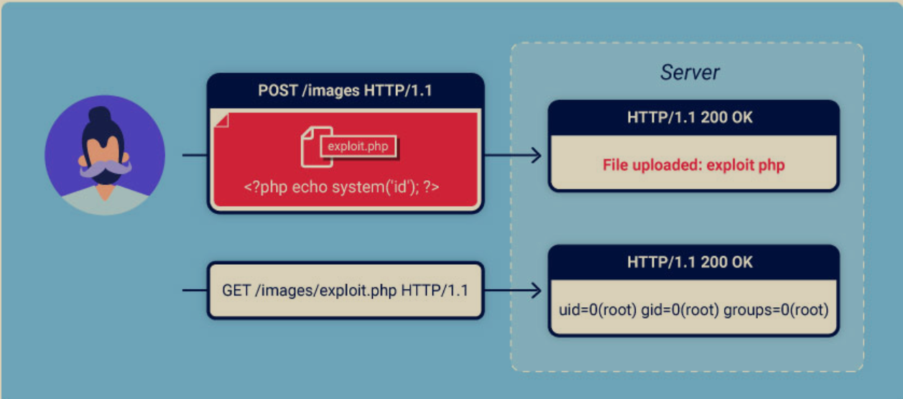

# File upload vulnerabilities

In this section, you'll learn how simple file upload functions can be used as a powerful vector for a number of high-severity attacks. We'll show you how to bypass common defense mechanisms in order to upload a web shell, enabling you to take full control of a vulnerable web server. Given how common file upload functions are, knowing how to test them properly is essential knowledge.



#### Labs

If you're already familiar with the basic concepts behind file upload vulnerabilities and just want to get practicing, you can access all of the labs in this topic from the link below.

[View all file upload labs](https://portswigger.net/web-security/all-labs#file-upload-vulnerabilities)

## What are file upload vulnerabilities?

File upload vulnerabilities are when a web server allows users to upload files to its filesystem without sufficiently validating things like their name, type, contents, or size. Failing to properly enforce restrictions on these could mean that even a basic image upload function can be used to upload arbitrary and potentially dangerous files instead. This could even include server-side script files that enable remote code execution.

In some cases, the act of uploading the file is in itself enough to cause damage. Other attacks may involve a **follow-up** HTTP request for the file, typically to trigger its execution by the server.

## What is the impact of file upload vulnerabilities?

The impact of file upload vulnerabilities generally depends on two key factors:

- Which aspect of the file the website fails to validate properly, whether that be its size, type, contents, and so on.
- What restrictions are imposed on the file once it has been successfully uploaded.

In the worst case scenario, the file's type isn't validated properly, and the server configuration allows certain types of file (such as `.php` and `.jsp`) to be executed as code. In this case, an attacker could potentially upload a server-side code file that functions as a web shell, effectively granting them full control over the server.

If the filename isn't validated properly, this could allow an attacker to overwrite critical files simply by uploading a file with the same name. If the server is also vulnerable to [directory traversal](https://portswigger.net/web-security/file-path-traversal), this could mean attackers are even able to upload files to **unanticipated** locations.

Failing to make sure that the size of the file falls within expected **thresholds** could also enable a form of denial-of-service (DoS) attack, whereby the attacker fills the available disk space.

## How do file upload vulnerabilities arise?

Given the fairly obvious dangers, it's rare for websites in the wild to have no restrictions whatsoever on which files users are allowed to upload. More commonly, developers implement what they believe to be robust validation that is either inherently flawed or can be easily bypassed.

For example, they may attempt to blacklist dangerous file types, but fail to account for parsing discrepancies when checking the file extensions. As with any blacklist, it's also easy to accidentally omit more **obscure** file types that may still be dangerous.

In other cases, the website may attempt to check the file type by verifying properties that can be easily manipulated by an attacker using tools like Burp Proxy or Repeater.

Ultimately, even robust validation measures may be applied inconsistently across the network of hosts and directories that form the website, resulting in discrepancies that can be exploited.

Later in this topic, we'll teach you how to [exploit a number of these flaws](https://portswigger.net/web-security/file-upload#exploiting-flawed-validation-of-file-uploads) to upload a web shell for remote code execution. We've even created some interactive, deliberately vulnerable labs so that you can practice what you've learned against some realistic targets.

## How do web servers handle requests for static files?

Before we look at how to exploit file upload vulnerabilities, it's important that you have a basic understanding of how servers handle requests for static files.

Historically, websites consisted almost entirely of static files that would be served to users when requested. As a result, the path of each request could be mapped 1:1 with the hierarchy of directories and files on the server's filesystem. Nowadays, websites are increasingly dynamic and the path of a request often has no direct relationship to the filesystem at all. **Nevertheless**（然而）, web servers still deal with requests for some static files, including stylesheets, images, and so on.

The process for handling these static files is still largely the same. At some point, the server parses the path in the request to identify the file extension. It then uses this to determine the type of the file being requested, typically by comparing it to a list of preconfigured mappings between extensions and MIME types. What happens next depends on the file type and the server's configuration.

- If this file type is non-executable, such as an image or a static HTML page, the server may just send the file's contents to the client in an HTTP response.
- If the file type is executable, such as a PHP file, **and** the server is configured to execute files of this type, it will assign variables based on the headers and parameters in the HTTP request before running the script. The resulting output may then be sent to the client in an HTTP response.
- If the file type is executable, but the server **is not** configured to execute files of this type, it will generally respond with an error. However, in some cases, the contents of the file may still be served to the client as plain text. Such misconfigurations can occasionally be exploited to leak source code and other sensitive information. You can see an [example](https://portswigger.net/web-security/information-disclosure/exploiting#source-code-disclosure-via-backup-files) of this in our [information disclosure](https://portswigger.net/web-security/information-disclosure) learning materials.

#### Tip

The `Content-Type` response header may provide clues as to what kind of file the server thinks it has served. If this header hasn't been explicitly set by the application code, it normally contains the result of the file extension/MIME type mapping.

Now that you're familiar with the key concepts, let's look at how you can potentially exploit these kinds of vulnerabilities.

## Exploiting unrestricted file uploads to deploy a web shell

From a security perspective, the worst possible scenario is when a website allows you to upload server-side scripts, such as PHP, Java, or Python files, and is also configured to execute them as code. This makes it trivial to create your own web shell on the server.

### Web shell

A web shell is a malicious script that enables an attacker to execute arbitrary commands on a remote web server simply by sending HTTP requests to the right endpoint.

If you're able to successfully upload a web shell, you effectively have full control over the server. This means you can read and write arbitrary files, exfiltrate sensitive data, even use the server to pivot attacks against both internal infrastructure and other servers outside the network. For example, the following PHP one-liner could be used to read arbitrary files from the server's filesystem:

```php
<?php echo file_get_contents('/path/to/target/file'); ?>
```

Once uploaded, sending a request for this malicious file will return the target file's contents in the response.

**LAB**

一个没有限制的文件上传漏洞实验。

[Remote code execution via web shell upload](https://portswigger.net/web-security/file-upload/lab-file-upload-remote-code-execution-via-web-shell-upload)

A more versatile web shell may look something like this:

```php
<?php echo system($_GET['command']); ?>
```

This script enables you to pass an arbitrary system command via a query parameter as follows:

```http
GET /example/exploit.php?command=id HTTP/1.1
```

## Exploiting flawed validation of file uploads

In the wild, it's unlikely that you'll find a website that has no protection whatsoever against file upload attacks like we saw in the previous lab. But just because defenses are in place, that doesn't mean that they're robust.

In this section, we'll look at some ways that web servers attempt to validate and sanitize file uploads, as well as how you can exploit flaws in these mechanisms to obtain a web shell for remote code execution.

### Flawed file type validation

When submitting HTML forms, the browser typically sends the provided data in a `POST` request with the content type `application/x-www-form-url-encoded`. This is fine for sending simple text like your name, address, and so on, but is not suitable for sending large amounts of binary data, such as an entire image file or a PDF document. In this case, the content type `multipart/form-data` is the preferred approach.

Consider a form containing fields for uploading an image, providing a description of it, and entering your username. Submitting such a form might result in a request that looks something like this:

```
POST /images HTTP/1.1 Host: normal-website.com Content-Length: 12345 Content-Type: multipart/form-data; boundary=---------------------------012345678901234567890123456 ---------------------------012345678901234567890123456 Content-Disposition: form-data; name="image"; filename="example.jpg" Content-Type: image/jpeg [...binary content of example.jpg...] ---------------------------012345678901234567890123456 Content-Disposition: form-data; name="description" This is an interesting description of my image. ---------------------------012345678901234567890123456 Content-Disposition: form-data; name="username" wiener ---------------------------012345678901234567890123456--
```

As you can see, the message body is split into separate parts for each of the form's inputs. Each part contains a `Content-Disposition` header, which provides some basic information about the input field it relates to. These individual parts may also contain their own `Content-Type` header, which tells the server the MIME type of the data that was submitted using this input.

One way that websites may attempt to validate file uploads is to check that this input-specific `Content-Type` header matches an expected MIME type. If the server is only expecting image files, for example, it may only allow types like `image/jpeg` and `image/png`. Problems can arise when the value of this header is implicitly trusted by the server. If no further validation is performed to check whether the contents of the file actually match the supposed MIME type, this defense can be easily bypassed using tools like Burp Repeater.

**LAB**

**APPRENTICE**[Web shell upload via Content-Type restriction bypass](https://portswigger.net/web-security/file-upload/lab-file-upload-web-shell-upload-via-content-type-restriction-bypass)

Not solved

### Preventing file execution in user-accessible directories

While it's clearly better to prevent dangerous file types being uploaded in the first place, the second line of defense is to stop the server from executing any scripts that do slip through the net.

As a precaution, servers generally only run scripts whose MIME type they have been explicitly configured to execute. Otherwise, they may just return some kind of error message or, in some cases, serve the contents of the file as plain text instead:

```
GET /static/exploit.php?command=id HTTP/1.1 Host: normal-website.com  HTTP/1.1 200 OK Content-Type: text/plain Content-Length: 39 <?php echo system($_GET['command']); ?>
```

This behavior is potentially interesting in its own right, as it may provide a way to leak source code, but it nullifies any attempt to create a web shell.

This kind of configuration often differs between directories. A directory to which user-supplied files are uploaded will likely have much stricter controls than other locations on the filesystem that are assumed to be out of reach for end users. If you can find a way to upload a script to a different directory that's not supposed to contain user-supplied files, the server may execute your script after all.

#### Tip

Web servers often use the `filename` field in `multipart/form-data` requests to determine the name and location where the file should be saved.

**LAB**

**PRACTITIONER**[Web shell upload via path traversal](https://portswigger.net/web-security/file-upload/lab-file-upload-web-shell-upload-via-path-traversal)

Not solved

You should also note that even though you may send all of your requests to the same domain name, this often points to a reverse proxy server of some kind, such as a load balancer. Your requests will often be handled by additional servers behind the scenes, which may also be configured differently.

### Insufficient blacklisting of dangerous file types

One of the more obvious ways of preventing users from uploading malicious scripts is to blacklist potentially dangerous file extensions like `.php`. The practice of blacklisting is inherently flawed as it's difficult to explicitly block every possible file extension that could be used to execute code. Such blacklists can sometimes be bypassed by using lesser known, alternative file extensions that may still be executable, such as `.php5`, `.shtml`, and so on.

#### Overriding the server configuration

As we discussed in the previous section, servers typically won't execute files unless they have been configured to do so. For example, before an Apache server will execute PHP files requested by a client, developers might have to add the following directives to their `/etc/apache2/apache2.conf` file:

```
LoadModule php_module /usr/lib/apache2/modules/libphp.so AddType application/x-httpd-php .php
```

Many servers also allow developers to create special configuration files within individual directories in order to override or add to one or more of the global settings. Apache servers, for example, will load a directory-specific configuration from a file called `.htaccess` if one is present.

Similarly, developers can make directory-specific configuration on IIS servers using a `web.config` file. This might include directives such as the following, which in this case allows JSON files to be served to users:

```
<staticContent>    <mimeMap fileExtension=".json" mimeType="application/json" /> </staticContent>
```

Web servers use these kinds of configuration files when present, but you're not normally allowed to access them using HTTP requests. However, you may occasionally find servers that fail to stop you from uploading your own malicious configuration file. In this case, even if the file extension you need is blacklisted, you may be able to trick the server into mapping an arbitrary, custom file extension to an executable MIME type.

**LAB**

**PRACTITIONER**[Web shell upload via extension blacklist bypass](https://portswigger.net/web-security/file-upload/lab-file-upload-web-shell-upload-via-extension-blacklist-bypass)

Not solved

#### Obfuscating file extensions

Even the most exhaustive blacklists can potentially be bypassed using classic obfuscation techniques. Let's say the validation code is case sensitive and fails to recognize that `exploit.pHp` is in fact a `.php` file. If the code that subsequently maps the file extension to a MIME type is **not** case sensitive, this discrepancy allows you to sneak malicious PHP files past validation that may eventually be executed by the server.

You can also achieve similar results using the following techniques:

- Provide multiple extensions. Depending on the algorithm used to parse the filename, the following file may be interpreted as either a PHP file or JPG image: `exploit.php.jpg`
- Add trailing characters. Some components will strip or ignore trailing whitespaces, dots, and suchlike: `exploit.php.`
- Try using the URL encoding (or double URL encoding) for dots, forward slashes, and backward slashes. If the value isn't decoded when validating the file extension, but is later decoded server-side, this can also allow you to upload malicious files that would otherwise be blocked: `exploit%2Ephp`
- Add semicolons or URL-encoded null byte characters before the file extension. If validation is written in a high-level language like PHP or Java, but the server processes the file using lower-level functions in C/C++, for example, this can cause discrepancies in what is treated as the end of the filename: `exploit.asp;.jpg` or `exploit.asp%00.jpg`
- Try using multibyte unicode characters, which may be converted to null bytes and dots after unicode conversion or normalization. Sequences like `xC0 x2E`, `xC4 xAE` or `xC0 xAE` may be translated to `x2E` if the filename parsed as a UTF-8 string, but then converted to ASCII characters before being used in a path.

Other defenses involve stripping or replacing dangerous extensions to prevent the file from being executed. If this transformation isn't applied recursively, you can position the prohibited string in such a way that removing it still leaves behind a valid file extension. For example, consider what happens if you strip `.php` from the following filename:

```
exploit.p.phphp
```

This is just a small selection of the many ways it's possible to obfuscate file extensions.

**LAB**

**PRACTITIONER**[Web shell upload via obfuscated file extension](https://portswigger.net/web-security/file-upload/lab-file-upload-web-shell-upload-via-obfuscated-file-extension)

Not solved

### Flawed validation of the file's contents

Instead of implicitly trusting the `Content-Type` specified in a request, more secure servers try to verify that the contents of the file actually match what is expected.

In the case of an image upload function, the server might try to verify certain intrinsic properties of an image, such as its dimensions. If you try uploading a PHP script, for example, it won't have any dimensions at all. Therefore, the server can deduce that it can't possibly be an image, and reject the upload accordingly.

Similarly, certain file types may always contain a specific sequence of bytes in their header or footer. These can be used like a fingerprint or signature to determine whether the contents match the expected type. For example, JPEG files always begin with the bytes `FF D8 FF`.

This is a much more robust way of validating the file type, but even this isn't foolproof. Using special tools, such as ExifTool, it can be trivial to create a polyglot JPEG file containing malicious code within its metadata.

**LAB**

**PRACTITIONER**[Remote code execution via polyglot web shell upload](https://portswigger.net/web-security/file-upload/lab-file-upload-remote-code-execution-via-polyglot-web-shell-upload)

Not solved

### Exploiting file upload race conditions

Modern frameworks are more battle-hardened against these kinds of attacks. They generally don't upload files directly to their intended destination on the filesystem. Instead, they take precautions like uploading to a temporary, sandboxed directory first and randomizing the name to avoid overwriting existing files. They then perform validation on this temporary file and only transfer it to its destination once it is deemed safe to do so.

That said, developers sometimes implement their own processing of file uploads independently of any framework. Not only is this fairly complex to do well, it can also introduce dangerous race conditions that enable an attacker to completely bypass even the most robust validation.

For example, some websites upload the file directly to the main filesystem and then remove it again if it doesn't pass validation. This kind of behavior is typical in websites that rely on anti-virus software and the like to check for malware. This may only take a few milliseconds, but for the short time that the file exists on the server, the attacker can potentially still execute it.

These vulnerabilities are often extremely subtle, making them difficult to detect during blackbox testing unless you can find a way to leak the relevant source code.

**LAB**

**EXPERT**[Web shell upload via race condition](https://portswigger.net/web-security/file-upload/lab-file-upload-web-shell-upload-via-race-condition)

Not solved

#### Race conditions in URL-based file uploads

Similar race conditions can occur in functions that allow you to upload a file by providing a URL. In this case, the server has to fetch the file over the internet and create a local copy before it can perform any validation.

As the file is loaded using HTTP, developers are unable to use their framework's built-in mechanisms for securely validating files. Instead, they may manually create their own processes for temporarily storing and validating the file, which may not be quite as secure.

For example, if the file is loaded into a temporary directory with a randomized name, in theory, it should be impossible for an attacker to exploit any race conditions. If they don't know the name of the directory, they will be unable to request the file in order to trigger its execution. On the other hand, if the randomized directory name is generated using pseudo-random functions like PHP's `uniqid()`, it can potentially be brute-forced.

To make attacks like this easier, you can try to extend the amount of time taken to process the file, thereby lengthening the window for brute-forcing the directory name. One way of doing this is by uploading a larger file. If it is processed in chunks, you can potentially take advantage of this by creating a malicious file with the payload at the start, followed by a large number of arbitrary padding bytes.

## Exploiting file upload vulnerabilities without remote code execution

In the examples we've looked at so far, we've been able to upload server-side scripts for remote code execution. This is the most serious consequence of an insecure file upload function, but these vulnerabilities can still be exploited in other ways.

### Uploading malicious client-side scripts

Although you might not be able to execute scripts on the server, you may still be able to upload scripts for client-side attacks. For example, if you can upload HTML files or SVG images, you can potentially use `<script>` tags to create [stored XSS](https://portswigger.net/web-security/cross-site-scripting/stored) payloads.

If the uploaded file then appears on a page that is visited by other users, their browser will execute the script when it tries to render the page. Note that due to [same-origin policy](https://portswigger.net/web-security/cors/same-origin-policy) restrictions, these kinds of attacks will only work if the uploaded file is served from the same origin to which you upload it.

### Exploiting vulnerabilities in the parsing of uploaded files

If the uploaded file seems to be both stored and served securely, the last resort is to try exploiting vulnerabilities specific to the parsing or processing of different file formats. For example, you know that the server parses XML-based files, such as Microsoft Office `.doc` or `.xls` files, this may be a potential vector for [XXE injection](https://portswigger.net/web-security/xxe) attacks.

## Uploading files using PUT

It's worth noting that some web servers may be configured to support `PUT` requests. If appropriate defenses aren't in place, this can provide an alternative means of uploading malicious files, even when an upload function isn't available via the web interface.

```
PUT /images/exploit.php HTTP/1.1 Host: vulnerable-website.com Content-Type: application/x-httpd-php Content-Length: 49 <?php echo file_get_contents('/path/to/file'); ?>
```

#### Tip

You can try sending `OPTIONS` requests to different endpoints to test for any that advertise support for the `PUT` method.

## How to prevent file upload vulnerabilities

Allowing users to upload files is commonplace and doesn't have to be dangerous as long as you take the right precautions. In general, the most effective way to protect your own websites from these vulnerabilities is to implement all of the following practices:

- Check the file extension against a whitelist of permitted extensions rather than a blacklist of prohibited ones. It's much easier to guess which extensions you might want to allow than it is to guess which ones an attacker might try to upload.
- Make sure the filename doesn't contain any substrings that may be interpreted as a directory or a traversal sequence (`../`).
- Rename uploaded files to avoid collisions that may cause existing files to be overwritten.
- Do not upload files to the server's permanent filesystem until they have been fully validated.
- As much as possible, use an established framework for preprocessing file uploads rather than attempting to write your own validation mechanisms.