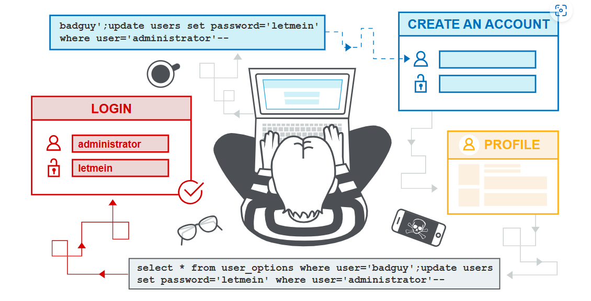

# [SQL injection](https://portswigger.net/web-security/sql-injection)

In this section, we explain:

- What SQL injection (SQLi) is.
- How to find and exploit different types of SQLi vulnerabilities.
- How to prevent SQLi.


#### Labs

If you're familiar with the basic concepts behind SQLi vulnerabilities and want to practice exploiting them on some realistic, deliberately vulnerable targets, you can access labs in this topic from the link below.

- [View all SQL injection labs](https://portswigger.net/web-security/all-labs#sql-injection)

## What is SQL injection (SQLi)?

SQL injection (SQLi) is a web security vulnerability that allows an attacker to interfere with the queries that an application makes to its database. This can allow an attacker to view data that they are not normally able to retrieve. This might include data that belongs to other users, or any other data that the application can access. In many cases, an attacker can modify or delete this data, causing persistent changes to the application's content or behavior.

In some situations, an attacker can escalate a SQL injection attack to compromise the underlying server or other back-end infrastructure. It can also enable them to perform denial-of-service attacks.

官方给出了一个视频，具体链接如下：

```html
<iframe src="https://www.youtube.com/embed/wX6tszfgYp4?origin=https://portswigger.net&amp;rel=0" allowfullscreen="" data-pp-element-found="" style="box-sizing: border-box; top: 0px; left: 0px; width: 860px; height: 483.75px; border: 0px;"></iframe>
```

## What is the impact of a successful SQL injection attack?

A successful SQL injection attack can result in unauthorized access to sensitive data, such as:

- Passwords.
- Credit card details.
- Personal user information.

SQL injection attacks have been used in many high-profile data breaches over the years. These have caused reputational damage and regulatory fines. In some cases, an attacker can obtain a persistent backdoor into an organization's systems, leading to a long-term compromise that can go unnoticed for an extended period.

## How to detect SQL injection vulnerabilities

You can detect SQL injection manually using a systematic set of tests against every entry point in the application. To do this, you would typically submit:

- The single quote character `'` and look for errors or other anomalies.
- Some SQL-specific syntax that evaluates to the base (original) value of the entry point, and to a different value, and look for systematic differences in the application responses.
- Boolean conditions such as `OR 1=1` and `OR 1=2`, and look for differences in the application's responses.
- Payloads designed to trigger time delays when executed within a SQL query, and look for differences in the time taken to respond.
- [OAST](https://portswigger.net/burp/application-security-testing/oast) payloads designed to trigger an out-of-band network interaction when executed within a SQL query, and monitor any resulting interactions.

Alternatively, you can find the majority of SQL injection vulnerabilities quickly and reliably using [Burp Scanner](https://portswigger.net/burp/vulnerability-scanner).

## SQL injection in different parts of the query

Most SQL injection vulnerabilities occur within the `WHERE` clause of a `SELECT` query. Most experienced testers are familiar with this type of SQL injection.

However, SQL injection vulnerabilities can occur at any location within the query, and within different query types. Some other common locations where SQL injection arises are:

- In `UPDATE` statements, within the updated values or the `WHERE` clause.
- In `INSERT` statements, within the inserted values.
- In `SELECT` statements, within the table or column name.
- In `SELECT` statements, within the `ORDER BY` clause.

## SQL injection examples

There are lots of SQL injection vulnerabilities, attacks, and techniques, that occur in different situations. Some common SQL injection examples include:

- [Retrieving hidden data](https://portswigger.net/web-security/sql-injection#retrieving-hidden-data), where you can modify a SQL query to return additional results.
- [Subverting application logic](https://portswigger.net/web-security/sql-injection#subverting-application-logic), where you can change a query to interfere with the application's logic.
- [UNION attacks](https://portswigger.net/web-security/sql-injection/union-attacks), where you can retrieve data from different database tables.
- [Blind SQL injection](https://portswigger.net/web-security/sql-injection/blind), where the results of a query you control are not returned in the application's responses.

## Retrieving hidden data

Imagine a shopping application that displays products in different categories. When the user clicks on the **Gifts** category, their browser requests the URL:

```http
https://insecure-website.com/products?category=Gifts
```

This causes the application to make a SQL query to retrieve details of the relevant products from the database:

```http
SELECT * FROM products WHERE category = 'Gifts' AND released = 1
```

This SQL query asks the database to return:

- all details (`*`)
- from the `products` table
- where the `category` is `Gifts`
- and `released` is `1`.

The restriction `released = 1` is being used to hide products that are not released. We could assume for unreleased products, `released = 0`.

The application doesn't implement any defenses against SQL injection attacks. This means an attacker can construct the following attack, for example:

```http
https://insecure-website.com/products?category=Gifts'--
```

This results in the SQL query:

```sql
SELECT * FROM products WHERE category = 'Gifts'--' AND released = 1
```

Crucially, note that `--` is a comment indicator in SQL. This means that the rest of the query is interpreted as a comment, effectively removing it. In this example, this means the query no longer includes `AND released = 1`. As a result, all products are displayed, including those that are not yet released.

You can use a similar attack to cause the application to display all the products in any category, including categories that they don't know about:

```http
https://insecure-website.com/products?category=Gifts'+OR+1=1--
```

This results in the SQL query:

```http
SELECT * FROM products WHERE category = 'Gifts' OR 1=1--' AND released = 1
```

The modified query returns all items where either the `category` is `Gifts`, or `1` is equal to `1`. As `1=1` is always true, the query returns all items.

**Warning**

Take care when injecting the condition `OR 1=1` into a SQL query. Even if it appears to be harmless in the context you're injecting into, it's common for applications to use data from a single request in multiple different queries. If your condition reaches an `UPDATE` or `DELETE` statement, for example, it can result in an accidental loss of data.

##### **LAB**

[SQL injection vulnerability in WHERE clause allowing retrieval of hidden data](https://portswigger.net/web-security/sql-injection/lab-retrieve-hidden-data)

## Subverting application logic

Imagine an application that lets users log in with a username and password. If a user submits the username `wiener` and the password `bluecheese`, the application checks the credentials by performing the following SQL query:

```sql
SELECT * FROM users WHERE username = 'wiener' AND password = 'bluecheese'
```

If the query returns the details of a user, then the login is successful. Otherwise, it is rejected.

In this case, an attacker can log in as any user without the need for a password. They can do this using the SQL comment sequence `--` to remove the password check from the `WHERE` clause of the query. For example, submitting the username `administrator'--` and a blank password results in the following query:

```sql
SELECT * FROM users WHERE username = 'administrator'--' AND password = ''
```

This query returns the user whose `username` is `administrator` and successfully logs the attacker in as that user.

##### **LAB**

[SQL injection vulnerability allowing login bypass](https://portswigger.net/web-security/sql-injection/lab-login-bypass)

## Retrieving data from other database tables

In cases where the application responds with the results of a SQL query, an attacker can use a SQL injection vulnerability to retrieve data from other tables within the database. You can use the `UNION` keyword to execute an additional `SELECT` query and append the results to the original query.

For example, if an application executes the following query containing the user input `Gifts`:

```sql
SELECT name, description FROM products WHERE category = 'Gifts'
```

An attacker can submit the input:

```sql
' UNION SELECT username, password FROM users--
```

This causes the application to return all usernames and passwords along with the names and descriptions of products.

**Read more**

- [SQL injection UNION attacks](https://portswigger.net/web-security/sql-injection/union-attacks)

## Blind SQL injection vulnerabilities

Many instances of SQL injection are blind vulnerabilities. This means that the application does not return the results of the SQL query or the details of any database errors within its responses. Blind vulnerabilities can still be exploited to access unauthorized data, but the techniques involved are generally more complicated and difficult to perform.

The following techniques can be used to exploit blind SQL injection vulnerabilities, depending on the nature of the vulnerability and the database involved:

- You can change the logic of the query to trigger a detectable difference in the application's response depending on the truth of a single condition. This might involve injecting a new condition into some Boolean logic, or conditionally triggering an error such as a divide-by-zero.
- You can conditionally trigger a time delay in the processing of the query. This enables you to infer the truth of the condition based on the time that the application takes to respond.
- You can trigger an out-of-band network interaction, using OAST techniques. This technique is extremely powerful and works in situations where the other techniques do not. Often, you can directly exfiltrate data via the out-of-band channel. For example, you can place the data into a DNS lookup for a domain that you control.

**Read more**

- [Blind SQL injection](https://portswigger.net/web-security/sql-injection/blind)

## Second-order SQL injection

First-order SQL injection occurs when the application processes user input from an HTTP request and incorporates the input into a SQL query in an unsafe way.

Second-order SQL injection occurs when the application takes user input from an HTTP request and stores it for future use. This is usually done by placing the input into a database, but no vulnerability occurs at the point where the data is stored. Later, when handling a different HTTP request, the application retrieves the stored data and incorporates it into a SQL query in an unsafe way. For this reason, second-order SQL injection is also known as stored SQL injection.



Second-order SQL injection often occurs in situations where developers are aware of SQL injection vulnerabilities, and so safely handle the initial placement of the input into the database. When the data is later processed, it is deemed to be safe, since it was previously placed into the database safely. At this point, the data is handled in an unsafe way, because the developer wrongly deems it to be trusted.

## Examining the database

Some core features of the SQL language are implemented in the same way across popular database platforms, and so many ways of detecting and exploiting SQL injection vulnerabilities work identically on different types of database.

However, there are also many differences between common databases. These mean that some techniques for detecting and exploiting SQL injection work differently on different platforms. For example:

- Syntax for string concatenation.
- Comments.
- Batched (or stacked) queries.
- Platform-specific APIs.
- Error messages.

##### Read more

[SQL injection cheat sheet](https://portswigger.net/web-security/sql-injection/cheat-sheet)

After you identify a SQL injection vulnerability, it's often useful to obtain information about the database. This information can help you to exploit the vulnerability.

You can query the version details for the database. Different methods work for different database types. This means that if you find a particular method that works, you can infer the database type. For example, on Oracle you can execute:

```sql
SELECT * FROM v$version
```

You can also identify what database tables exist, and the columns they contain. For example, on most databases you can execute the following query to list the tables:

```sql
SELECT * FROM information_schema.tables
```

##### Read more

- [Examining the database in SQL injection attacks](https://portswigger.net/web-security/sql-injection/examining-the-database)
- [SQL injection cheat sheet](https://portswigger.net/web-security/sql-injection/cheat-sheet)

## SQL injection in different contexts

In the previous labs, you used the query string to inject your malicious SQL payload. However, you can perform SQL injection attacks using any controllable input that is processed as a SQL query by the application. For example, some websites take input in JSON or XML format and use this to query the database.

These different formats may provide different ways for you to [obfuscate attacks](https://portswigger.net/web-security/essential-skills/obfuscating-attacks-using-encodings#obfuscation-via-xml-encoding) that are otherwise blocked due to WAFs and other defense mechanisms. Weak implementations often look for common SQL injection keywords within the request, so you may be able to bypass these filters by encoding or escaping characters in the prohibited keywords. For example, the following XML-based SQL injection uses an XML escape sequence to encode the `S` character in `SELECT`:

```html
<stockCheck>
    <productId>123</productId>
    <storeId>999 &#x53;ELECT * FROM information_schema.tables</storeId>
</stockCheck>
```

This will be decoded server-side before being passed to the SQL interpreter.

**LAB**

[SQL injection with filter bypass via XML encoding](https://portswigger.net/web-security/sql-injection/lab-sql-injection-with-filter-bypass-via-xml-encoding)

## How to prevent SQL injection

You can prevent most instances of SQL injection using **parameterized queries** instead of string concatenation within the query. These parameterized queries are also know as "prepared statements".

The following code is vulnerable to SQL injection because the user input is concatenated directly into the query:

```sql
String query = "SELECT * FROM products WHERE category = '"+ input + "'"; 
Statement statement = connection.createStatement(); 
ResultSet resultSet = statement.executeQuery(query);
```

You can rewrite this code in a way that prevents the user input from interfering with the query structure:

```sql
PreparedStatement statement = connection.prepareStatement("SELECT * FROM products WHERE category = ?"); statement.setString(1, input); 
ResultSet resultSet = statement.executeQuery();
```

You can use parameterized queries for any situation where untrusted input appears as data within the query, including the `WHERE` clause and values in an `INSERT` or `UPDATE` statement. They can't be used to handle untrusted input in other parts of the query, such as table or column names, or the `ORDER BY` clause. Application functionality that places untrusted data into these parts of the query needs to take a different approach, such as:

- Whitelisting permitted input values.
- Using different logic to deliver the required behavior.

For a parameterized query to be effective in preventing SQL injection, the string that is used in the query must always be a hard-coded constant. It must never contain any variable data from any origin. Do not be tempted to decide case-by-case whether an item of data is trusted, and continue using string concatenation within the query for cases that are considered safe. It's easy to make mistakes about the possible origin of data, or for changes in other code to taint trusted data.

#### Read more

- [Find SQL injection vulnerabilities using Burp Suite's web vulnerability scanner](https://portswigger.net/burp/vulnerability-scanner)